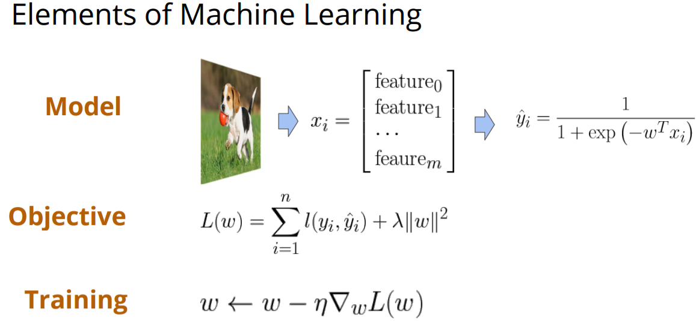

# Lecture 1: A Crash Course on Deep Learning

## Elements of Machine Learning

First, we start from three machine learning keypoints as below:

- Model: a specific format or formula, such as $y=kx+b$, $x$ and $y$ are features and label (class, annotation or others) respectively from one sample. However, both $w$ and $b$ are unknown for us (of course, we can initial them with some random values). To summarize, input $x_{i}$ in, class probability $\hat{y_{i}}$ out.
- Objective: an object to reflect the gap/difference of a model between perfect status and current status.
- Training: a procedure to minimize the gap. Due to stability of $x$ and $y$, the only changeable are $k$ and $b$.

On this page, we can see a dog picture as an input $x_{i}$, representing an feature vector. And after model transformation (the formula to caculate $\hat{y_{i}}$), we get the class probability of this picture.

$x_{i}$ represents a sample or an example (here is an image). $i$ means the current order of this dataset (ith image in this image dataset). $feature_{0}$, $feature_{1}$ till $feature_{m}$ are all the features of one sample/example (For a sample or an example, we assume it has $m$ features). Each feature may have its specific meaning and includes one or multiple number (integer/float/double type) or characters (string/char type).

$\hat{y_{i}}$ represents an inference or predicted result for example $x_{i}$. The formula of $\hat{y_{i}}$ is of logistic regression format (log-like linear model). $w$ acts as $b$ in $\hat{y_{i}} = kx_{i} + b$, calculated step by step in training and initalized with an random or fixed value.
